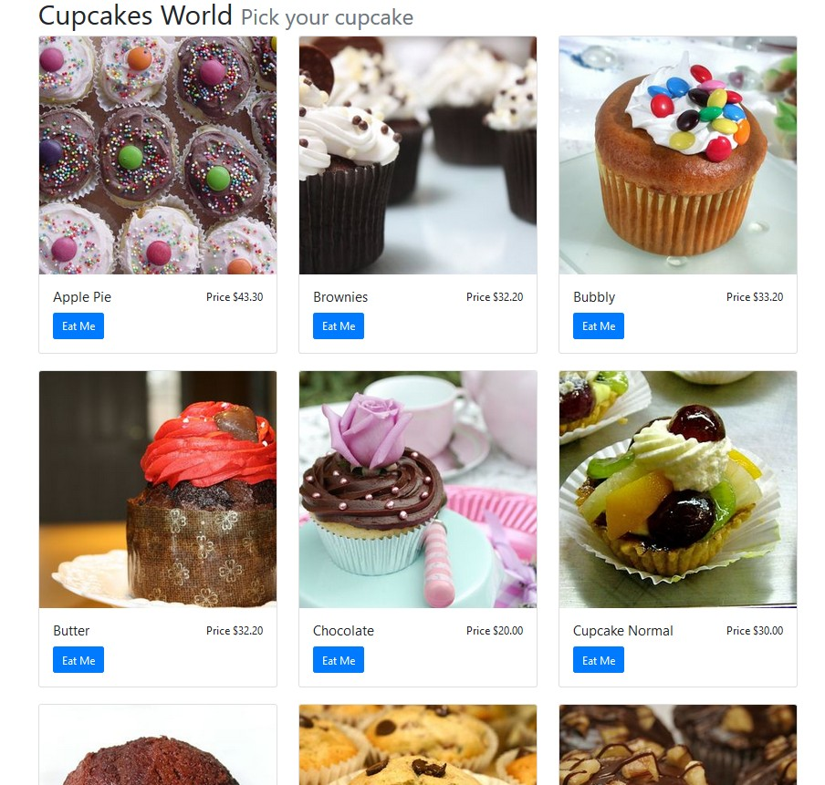
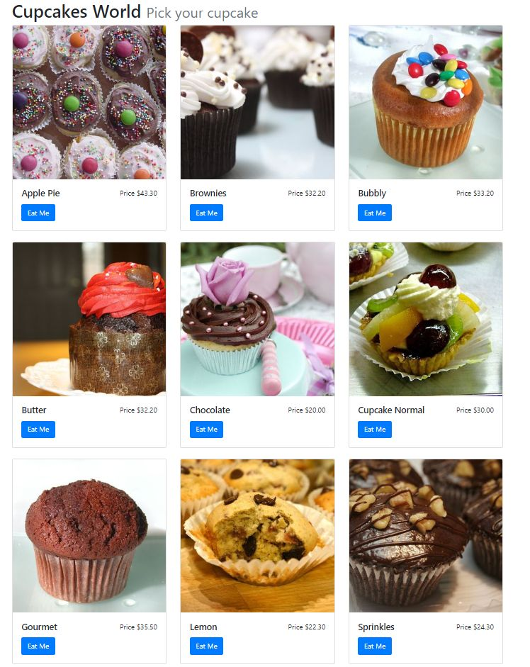
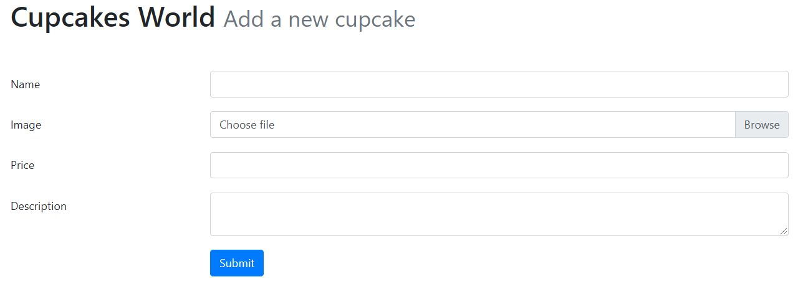
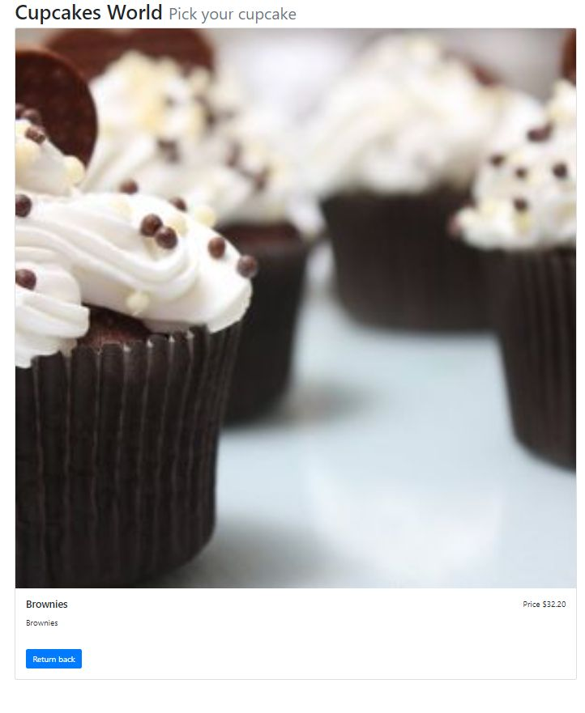

# A basic catalog of products (new Version) made with PHP



It is a project that shows the creation of a basic catalog of products in an hour. This catalog has the information loaded, so we don't need to add more products.

## Requirements

This project requires PHP 5.6 or higher, Mysql installed and running and PHP Composer (it is a free library)  

### Composer Initialize

First, you must initialize the project.

* Create a new folder.
* Inside the folder, run the next command:

> composer init 

And follow the instructions of composer.

In **composer.json** (or where we are initializing), we need to add the next libraries:

> ```j
> "eftec/bladeone": "^3.46.1", // to view our templates
> "eftec/pdoone": "^1.48",     // to access to the database
> "eftec/validationone": "^1.24.2", // to validate the user input.
> ```


### Configuration of the database

In the file 📃**app.php**

```php
$pdoOne=new PdoOne('mysql',"127.0.0.1","root","abc.123","cupcakes");
$pdoOne->logLevel=3;
$pdoOne->open();
```

Edit the information of the database.  In this example: root is the user, abc.123 is the database. and cupcakes is the new schema. (we will create if there is no one)

The **loglevel** is for debug purpose. If the system fails, then it will show a lengthy message of error, showing the last query, arguments and reason of it. Later, you want to remove this line.

## Initializing the database

We need to create a new schema called cupcakes, so we included a file called 📃**initialize.php**. it creates the schema, the table and it adds sample data.

This code creates all the relations.
```php
$relations=['cupcakes'=>'CupcakeRepo']; // table=>class
$logs=$pdoOne->generateAllClasses($relations,'CupcakeDataBase','',__DIR__);
```

* We will use a single table called  🗒 "cupcakes". We will also need a class called Repository Class (or Repository Service). Usually, there is one class per table but we will have two classes per entity. 

It also creates 3 files:

* 📃 CupcakeDataBase.php  It is a class that is common for all the tables/entities. It is generated automatically, so you don't want to edit it manually.
* 📃 CupcakeRepo.php  It is the first part of the Repository class. This file is not replaced if it exists. So, if you want to edit the file, then edit this one.
* 📃 CupcakeRepoExt.php  It is the second part of the repository class.  This file is also generated automatically but you don't want to edit it.

## Repository class

How this repository class works?

* First, for work, you must need to inject an instance of **PdoOne** (our library to connect to the database), or we could create a public function called PdoOne() or we could create a public variable called **$pdoOne**.  All of those method works. In our case, we will use the variable called **$pdoOn**e.

Let's say we want to modify a row in the table **cupcakes**.

```php
// where entity is an array with the name of the columns, case sensitve.
// update
CupcakeRepo::update($entity); // update a row
// insert
CupcakeRepo::insert($entity); // insert a row
// delete
CupcakeRepo::deleteById(20); // where id is the primary key that we want to delete
// get
CupcakeRepo::first(20); // we get a single row (or false if it fails)
// list
CupcakeRepo::toList(); // we get all the rows of the table
// list filtered
CupcakeRepo::where('Price>?',['i',50])::toList(); //we get all the rows where price is > 50 
												  //(the 'i' indicates integer and 's' for string/float)
// List ordered and filtered
CupcakeRepo::where('Price>?',['i',50])::order('Name')::toList(); // select * from cupcakes where price>50 order by name

```

Example:

```php
$entity=CupcakeRepo::factorynull(); // we create an empty array
// $entity['IdCupcake']=5; // we don't need to edit it because the column is identity/autonumeric.
$entity['Name']='new name'; // The case of the key of the array matter.
$entity['Value']=555;
$entity['Image']='image.jpg';
$entity['Description']='It is an example';

CupcakeRepo::inset($entity); // where entity is an array with the name of the columns, case sensitve.


```

## Showing the information

### Listing (catalog_mysql.php)

It is simple:

```php
$cupcakes=(CupcakeRepo::order('name'))::toList(); // We read the rows from the database

echo $blade->run("cupcakes.catalog"
   ,['cupcakes'=>$cupcakes,'postfix'=>'mysql']); // cupcakes.catalog = /views/cupcakes/catalog.blade.php
```

📁 \views   
..... 📁 \cupcakes   
..... ..... 📝 catalog.blade.php   <-- our view.

It will generate a file in the folder compiles

📁 \compiles
.....  📝7e8338714c0c98ded4c4cf1724df88ebf0cfeb0d.bladec (it is generated automatically)   



### Creating a new Product (create_product.php)

#### If the button hasn't been clicked

If the button hasn't been clicked, then we create an empty cupcake and we show in the screen

```php
$cupcake=CupcakeRepo::factoryNull();
```

📁 \views   
..... 📁 \cupcakes   
..... ..... 📝 form.blade.php   <-- our view.




#### If the button has been pressed.

If the button has been pressed then, initially we collect the information entered by the user and we validate it.

Example:

```php
$cupcake['Name'] = $validaton
   ->def("")// what if the value is not read?, we should show something (or null)
   ->ifFailThenDefault(false)// if fails then we show the same value however it triggers an error
   ->type("varchar")// it is required to ind
   ->condition("req", "this value (%field) is required")
   ->condition("minlen", "The minimum lenght is 3", 3)
   ->condition("maxlen", "The maximum lenght is 100", 100)
   ->post('name'); // frm_name.  It also generates a message container called "name".
```

If the information is correct, then we move the temporal image (if any) and we inserted into the database

```php
if (empty($validaton->getMessages())) {
   // 1) the button was pressed and there is not error.
   move_uploaded_file($cupcake['Image'][1],'img/'.$cupcake['Image'][0]);
   $cupcake['Image']=$cupcake['Image'][0]; // now Image is only the name, not an array
       CupcakeRepo::insert($cupcake);
   header("Location:catalog_mysql.php");
}
```


### Viewing a product (detail_mysql.php)

Finally, we create a new code to view a single product.

Instead of getting a list of entities, we get a single line (command first)

```php
$id=$validaton->type('integer')->get('id');
$cupcake=CupcakeRepo::first($id);
echo $blade->run("cupcakes.detail",['cupcake'=>$cupcake,'postfix'=>'mysql']);
```

📁 \views   
..... 📁 \cupcakes   
..... ..... 📝 detail.blade.php   <-- our view.

